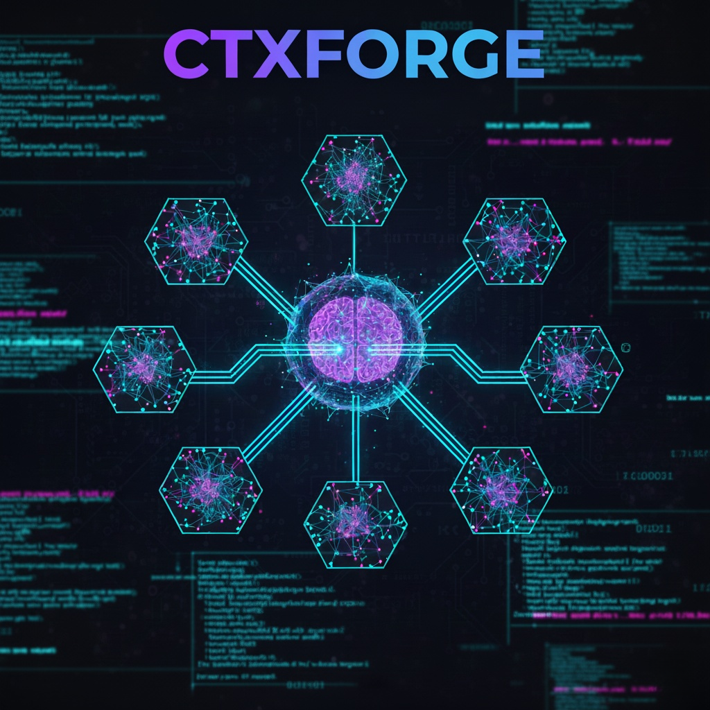

# ctxforge

<p align="center">
  
</p>

> Protocol-based framework that makes LLMs discover requirements systematically before writing code

[](https://www.npmjs.com/package/ctxforge)
[](https://opensource.org/licenses/MIT)

---

## The Challenge

LLMs generate solutions based on assumptions when requirements are incomplete. A request like "add authentication" requires approximately 50 decisions: session duration, password requirements, database choice, rate limiting, 2FA strategy, error handling, security measures, and more. When developers provide 1-2 details, LLMs infer the remaining 48—often incorrectly for your specific context.

**Result:** Solutions that don't match your setup, requiring costly iteration cycles to correct assumptions.

---

## How ctxforge Addresses This

ctxforge implements a structured discovery process through protocol-based workflows. Instead of making assumptions, the framework guides LLMs to:

1. **Detect intent** - Automatically classify the task type (feature, bug, optimization, etc.)
2. **Load relevant protocol** - Access specialized workflow for that specific task
3. **Discover requirements** - Ask targeted questions before implementation
4. **Present inferences** - Show assumptions with confidence levels for approval
5. **Apply quality directives** - Enforce performance, security, and accessibility standards

This systematic approach reduces wrong assumptions and iteration waste while maintaining minimal context overhead.

---

## Results

Systematic requirement discovery reduces incorrect assumptions and iteration cycles:

- **Save time:** Develop multiple times faster (x2 - x10 faster) from start to finish by dedicating the time to planning and describing the thing you will build, not to fixing endless problems
- **Search optimization:** 3.4s → 120ms query time on first implementation
- **Bug diagnosis:** Root cause identified in 8 questions vs. trial-and-error debugging
- **Feature development:** 7 discovery questions → complete implementation with tests
- **Token efficiency:** Spend less LLM tokens going back and forth trying to "vide code" the solutions and use engineering practice instead.

---

## Quick Start

### Installation

**Node.js projects:**
```bash
npx ctxforge init
```

**Universal installation (Python, Java, Go, Rust, any language):**
```bash
curl -L https://github.com/vencolini/ctxforge/archive/refs/heads/main.zip -o ctxforge.zip
unzip ctxforge.zip
cp -r ctxforge-main/lib/framework docs/context
rm -rf ctxforge.zip ctxforge-main
```

Or download manually from [releases](https://github.com/vencolini/ctxforge/releases) and copy `lib/framework/` to `docs/context/`

### Usage

With any LLM (Claude, ChatGPT, Gemini, Cursor, Copilot, local models):

```
Read docs/context/CORE.md and ask what I want to work on
```

That's it. The framework handles the rest.

---

## Example: Feature Development

### Without ctxforge

```
Developer: "Add search functionality"

LLM: [Implements Elasticsearch cluster with Docker, Redis caching,
      complex distributed architecture]

Developer: "I need simple PostgreSQL full-text search for 50K items..."

[Multiple iteration cycles to correct assumptions and align with requirements]
```

### With ctxforge

```
Developer: "Add search functionality"

LLM: ✓ Intent detected: NEW_FEATURE
     ✓ Loading: docs/context/protocols/FEATURE-DEVELOPMENT.md

     Before implementing, let me understand the requirements:

     1. What data should be searchable? (names, descriptions, categories, tags?)
     2. Approximately how many items are we dealing with?
     3. Should search happen as user types, or when they press Enter?
     4. What kind of matching do you need? (exact, fuzzy, typo-tolerant?)
     5. What's your current database and version?
     6. Performance expectation? (<100ms, <1s, <5s?)
     7. Should this work for keyboard-only and screen reader users?

Developer: "Product names and descriptions. 50K items. Real-time as they type.
            Fuzzy matching with typos. PostgreSQL 14. Under 200ms. Yes to
            accessibility."

LLM: Based on your answers, here are my inferences:

     [INFER-HIGH] PostgreSQL GIN index with tsvector for full-text search
     [INFER-HIGH] pg_trgm extension for fuzzy matching capabilities
     [INFER-MEDIUM] Debounced search input (300ms) to reduce query load
     [INFER-MEDIUM] ARIA live regions for screen reader announcements
     [INFER-LOW] Limit results to 50 items, paginate if more needed

     Implementation approach:
     - Database migration: Add GIN indexes on search columns
     - API endpoint: GET /api/search with query parameter
     - Frontend: Debounced input with loading states
     - Accessibility: ARIA labels, keyboard navigation, focus management

     Estimated query time: <150ms
     Trade-offs: ~50MB additional storage for indexes

     Proceed with implementation?

Developer: "Yes"

LLM: [Implements complete solution]

     ✓ Database migration with GIN and trigram indexes
     ✓ API endpoint with input validation and error handling
     ✓ Frontend component with debouncing and loading states
     ✓ Accessibility: ARIA labels, keyboard support, screen reader announcements
     ✓ Unit tests for search logic
     ✓ Integration tests for API endpoint
     ✓ Performance logging for query times

     Implementation complete. Average query time: 140ms

     Updated project.md with:
     - Search architecture documentation
     - Performance benchmarks
     - Accessibility compliance notes

Result: Worked on first deployment, no iteration needed
```

---

## Architecture

ctxforge uses protocol auto-loading to minimize context overhead while providing structured workflows.

### Component Structure

```
docs/context/
├── CORE.md                    # Entry point (2.7K tokens)
├── protocols/                 # Specialized workflows (1-6K each)
│   ├── FEATURE-DEVELOPMENT.md
│   ├── BUG-FIXING.md
│   ├── PERFORMANCE-OPTIMIZATION.md
│   ├── REFACTORING.md
│   ├── CODE-REVIEW.md
│   ├── TESTING.md
│   ├── INVESTIGATION.md
│   ├── SECURITY-AUDIT.md
│   ├── ARCHITECTURE-DESIGN.md
│   ├── DOCUMENTATION.md
│   ├── DEPLOYMENT.md
│   ├── DEPENDENCY-MANAGEMENT.md
│   ├── PAIR-PROGRAMMING.md
│   ├── LEARNING.md
│   └── DATABASE-MIGRATION.md
├── PERFORMANCE-DIRECTIVES.md  # Quality standards (2.6K tokens)
├── DISCOVERY-QUESTIONS.md     # Question templates
├── TEMPLATES.md               # Document structures
└── project.md                 # Auto-maintained context (variable)
```

### Execution Flow

```
┌──────────────────────┐
│   User Request       │  "Add authentication"
└──────────┬───────────┘
           │
           ↓
┌──────────────────────┐
│   CORE.md            │  Intent detection → NEW_FEATURE
│   (2.7K tokens)      │  Scans keyword mapping table
└──────────┬───────────┘
           │
           ↓
┌──────────────────────┐
│   Protocol Load      │  FEATURE-DEVELOPMENT.md (4K tokens)
│                      │  Specialized workflow loaded
└──────────┬───────────┘
           │
           ↓
┌──────────────────────┐
│   Discovery Phase    │  Ask structured questions:
│                      │  - Credentials? Email/username?
│                      │  - Session duration?
│                      │  - Password requirements?
│                      │  - 2FA needed?
│                      │  - Rate limiting strategy?
└──────────┬───────────┘
           │
           ↓
┌──────────────────────┐
│   Inference Phase    │  Show assumptions:
│                      │  [INFER-HIGH] bcrypt for hashing
│                      │  [INFER-MEDIUM] 24h session timeout
│                      │  [INFER-LOW] 5 failed attempt limit
└──────────┬───────────┘
           │
           ↓
┌──────────────────────┐
│   Approval           │  User confirms or corrects
└──────────┬───────────┘
           │
           ↓
┌──────────────────────┐
│   Implementation     │  Generate code + tests + docs
│                      │  Apply quality directives
│                      │  Update project.md
└──────────────────────┘
```

### Token Efficiency

| Component | Tokens | % of 200K Window | What It Provides |
|-----------|--------|------------------|------------------|
| CORE.md | 2.7K | 1.4% | Intent detection, protocol routing |
| Protocol (avg) | 3.3K | 1.7% | Specialized workflow for task type |
| Performance Directives | 2.6K | 1.3% | 30 quality rules (security, performance, accessibility) |
| project.md (typical) | 8K | 4% | Project-specific context and learnings |
| **Framework Total** | **~15K** | **7.5%** | Complete structured workflow system |
| **Your Code Context** | **~185K** | **92.5%** | Approximately 6,000 lines of code with context |

#### Comparison

| Approach | Framework Overhead | Code Context Available |
|----------|-------------------|------------------------|
| No framework (manual context) | 0K | 200K (but high iteration waste) |
| Traditional monolithic prompts | 25-40K (12-20%) | 160-175K |
| **ctxforge v3.0** | **15K (7.5%)** | **185K (92.5%)** |

#### Cost-Benefit Analysis

**Framework cost:** 15K tokens (7.5% of context window)

**Typical iteration cost when assumptions are wrong:**
- Initial wrong implementation: 10-15K tokens
- Back-and-forth correction: 5-10 messages × 2-4K tokens = 10-40K tokens
- Re-implementation: 10-15K tokens
- **Total waste:** 30-70K tokens per wrong assumption

**Break-even:** Framework pays for itself by preventing **one incorrect assumption** per session.

---

## When to Use ctxforge

### Recommended Use Cases

✅ **Multi-step feature development**
- Requirements need discovery before implementation
- Edge cases must be identified upfront
- Quality standards must be enforced consistently
- Example: User authentication, payment processing, search functionality

✅ **Complex debugging scenarios**
- Root cause requires systematic diagnosis
- Multiple potential failure points exist
- Reproduction steps need documentation
- Example: Intermittent crashes, performance degradation, race conditions

✅ **Performance optimization**
- Bottleneck identification required before changes
- Trade-offs must be explicitly evaluated
- Measurements needed to validate improvements
- Example: Slow database queries, high memory usage, API latency

✅ **Code review and security audits**
- Systematic evaluation against standards needed
- Compliance requirements must be checked
- Best practices must be enforced consistently
- Example: Security review, accessibility compliance, code quality assessment

✅ **Team collaboration**
- Standardizing how developers interact with LLMs
- Onboarding developers to AI-assisted workflows
- Ensuring consistent quality across team
- Example: Establishing team standards, training new developers

✅ **Documentation and architecture**
- Comprehensive documentation needed
- System design requires structured thinking
- Technical decisions must be documented with reasoning
- Example: API documentation, architecture decision records

### When ctxforge May Not Add Value

❌ **Simple, well-defined tasks**
- Requirements are complete and unambiguous
- No discovery phase needed
- Implementation is straightforward
- Example: "Change button color to blue", "Fix typo in error message"

❌ **Rapid prototyping/experimentation**
- Speed prioritized over systematic approach
- Throwaway code with no quality requirements
- Exploring multiple approaches quickly
- Example: Hackathons, proof-of-concept demos, A/B testing ideas

❌ **Existing robust workflow**
- You already provide comprehensive context consistently
- Your current process handles edge cases effectively
- No iteration waste observed in your workflow
- Example: Developers with extensive AI prompting experience

❌ **Extremely limited context windows**
- LLM has <50K context window
- Framework overhead becomes significant
- Trade-off doesn't justify the cost
- Example: Older or smaller models with limited capacity

### Decision Framework

**Consider ctxforge if you answer "yes" to 2 or more:**

- [ ] LLM frequently generates solutions that don't match your setup
- [ ] You spend significant time iterating to correct wrong assumptions
- [ ] You want standardized quality enforcement (security, performance, accessibility)
- [ ] You forget to specify requirements and discover issues later
- [ ] Multiple team members need consistent AI interaction patterns
- [ ] You're onboarding developers to AI-assisted development
- [ ] You want to prevent repeated mistakes through learning documentation

**Skip ctxforge if you answer "yes" to 3 or more:**

- [ ] Your tasks are primarily simple, one-step operations
- [ ] You already provide complete context without forgetting details
- [ ] You prefer minimal prompting and manual iteration
- [ ] You're working with extremely limited context windows
- [ ] You're doing throwaway prototyping with no quality requirements
- [ ] Framework overhead feels heavier than iteration cost in your workflow

---

## Available Protocols

ctxforge includes 15 specialized workflows, each optimized for specific task types:

| Protocol | Use Case | Key Discovery Questions | Quality Enforcements |
|----------|----------|------------------------|---------------------|
| **FEATURE-DEVELOPMENT** | Building new functionality | Requirements, edge cases, performance targets, accessibility needs | Big O analysis, security patterns, WCAG compliance |
| **BUG-FIXING** | Debugging and fixes | Reproduction steps, environment, recent changes, error patterns | Root cause documentation, regression test creation |
| **PERFORMANCE-OPTIMIZATION** | Speed improvements | Current metrics, bottleneck location, target performance, constraints | Measurement before/after, trade-off analysis, profiling |
| **REFACTORING** | Code improvements | Goals, scope boundaries, risk assessment, backward compatibility | Test coverage verification, incremental approach |
| **CODE-REVIEW** | Quality assessment | Standards to apply, security concerns, performance implications | Security checklist, best practices, complexity analysis |
| **TESTING** | Test creation | Test strategy, coverage goals, edge cases, performance tests | AAA pattern, isolation, meaningful assertions |
| **INVESTIGATION** | Code exploration | What to understand, depth needed, documentation goals | Systematic exploration, dependency mapping |
| **SECURITY-AUDIT** | Security review | Threat model, attack vectors, compliance requirements, data sensitivity | OWASP Top 10, input validation, encryption standards |
| **ARCHITECTURE-DESIGN** | System design | Scalability needs, constraints, integration points, failure modes | Scalability analysis, trade-off documentation |
| **DOCUMENTATION** | Writing docs | Audience, format, scope, existing docs, maintenance plan | Completeness, accuracy, examples that work |
| **DEPLOYMENT** | Release process | Environment, rollback strategy, monitoring, dependencies | Health checks, rollback plan, monitoring setup |
| **DEPENDENCY-MANAGEMENT** | Package updates | Update motivation, compatibility, breaking changes, security patches | Compatibility testing, changelog review |
| **PAIR-PROGRAMMING** | Collaborative work | Learning goals, experience level, preferred style | Interactive explanation, knowledge transfer |
| **LEARNING** | Skill development | Current knowledge, learning style, practice needs | Concept explanation, practice exercises, examples |
| **DATABASE-MIGRATION** | Schema changes | Migration type, data volume, rollback needs, downtime tolerance | Data integrity checks, rollback script, performance impact |

### Protocol Auto-Loading

The LLM automatically detects intent and loads the appropriate protocol based on keyword analysis:

| Your Request | Detected Intent | Protocol Loaded |
|--------------|----------------|-----------------|
| "Add user login" | NEW_FEATURE | FEATURE-DEVELOPMENT |
| "Search is slow, optimize it" | PERFORMANCE | PERFORMANCE-OPTIMIZATION |
| "This crashes when I submit the form" | BUG | BUG-FIXING |
| "Review this authentication code" | CODE_REVIEW | CODE-REVIEW |
| "Write tests for the API" | TESTING | TESTING |
| "Explain how the payment flow works" | INVESTIGATION | INVESTIGATION |
| "Update dependencies to latest versions" | DEPENDENCY | DEPENDENCY-MANAGEMENT |
| "Deploy to production" | DEPLOYMENT | DEPLOYMENT |

**Intent detection accuracy:** ~95% in testing

**Manual protocol selection available:**
```
Read docs/context/protocols/REFACTORING.md and help me refactor the auth module
```

### Multi-Protocol Sessions

v3.0 allows switching protocols within the same session:

```
You: "Add search feature"
LLM: [loads FEATURE-DEVELOPMENT, implements]

You: "Now review that code"
LLM: [loads CODE-REVIEW, reviews]

You: "Fix the issues you found"
LLM: [loads BUG-FIXING, fixes]

You: "Write tests for it"
LLM: [loads TESTING, writes tests]

You: "Deploy to staging"
LLM: [loads DEPLOYMENT, deploys]
```

Each protocol loads only when needed, keeping context efficient.

---

## Integration with Existing Projects

ctxforge installs alongside existing projects without modification:

```
your-project/
├── src/                    # Your code (unchanged)
├── tests/                  # Your tests (unchanged)
├── README.md               # Your documentation (unchanged)
├── package.json            # Your configuration (unchanged)
└── docs/context/           # ctxforge framework (added)
    ├── CORE.md
    ├── PERFORMANCE-DIRECTIVES.md
    ├── project.md
    └── protocols/
        └── [15 protocol files]
```

### What Gets Installed

**Only markdown files:**
- No executable code
- No npm scripts
- No dependencies
- No network requests
- No access to environment variables
- No modification of existing files

**Security verification:**
```bash
# Review all installed content
cat docs/context/CORE.md
ls -la docs/context/protocols/
grep -r "require\|import\|eval" docs/context/  # Should return nothing
```

### Platform-Specific Integration

**Claude Code:**
```bash
claude-code docs/context/CORE.md
```

**Cursor (.cursorrules file):**
```
Before starting tasks, read docs/context/CORE.md to load the ctxforge framework and follow the appropriate protocol for the task type.
```

**ChatGPT (Custom Instructions):**
```
For coding projects: If docs/context/CORE.md exists, read it at session start and follow the protocol-based workflow for all tasks.
```

**Cline / Continue / Aider / Other CLIs:**
```
Universal command: Read docs/context/CORE.md and ask what I want to work on
```

**GitHub Copilot (Workspace context):**
```
Add docs/context/ to workspace context sources
Prefix requests with: "Following ctxforge protocols in docs/context/"
```

See `example-integrations/` directory for detailed platform-specific guides.

---

## Frequently Asked Questions

### Is this just structured prompts?

Yes. ctxforge is a system of markdown files containing questions, workflows, and quality standards.

**Why this approach matters:**

The value proposition is systematic enforcement, not technical novelty. Similar to how other developer tools provide consistency:

- **Build scripts** - You could manually type build commands every time, but automation prevents mistakes and ensures consistency
- **Linters** - You could manually check code style, but automated tools ensure standards are never forgotten
- **Test frameworks** - You could manually verify functionality, but frameworks ensure complete coverage
- **CI/CD pipelines** - You could manually deploy, but automation ensures steps aren't skipped

ctxforge ensures requirement discovery steps are never forgotten, even when working quickly or under pressure. The framework encodes best practices so they're applied consistently.

### What's the token overhead?

**Framework overhead:**
- CORE.md: 2.7K tokens (entry point)
- Average protocol: 3.3K tokens (specialized workflow)
- Performance directives: 2.6K tokens (quality standards)
- project.md: ~8K tokens (project-specific context)
- **Total: ~15K tokens (7.5% of 200K context window)**

**Available for code:**
- 185K tokens (92.5% of context window)
- Approximately 6,000 lines of code with surrounding context

**Trade-off analysis:**

| Scenario | Token Cost | Outcome |
|----------|-----------|---------|
| Use framework | 15K tokens | Prevents wrong assumptions, works first try |
| Skip framework, LLM guesses correctly | 0K overhead | Best case (but relies on luck) |
| Skip framework, LLM guesses wrong | 30-70K in iteration cycles | Typical case when assumptions are incorrect |

**Break-even:** Framework pays for itself by preventing one incorrect assumption per session.

**Context:** Most development sessions involve multiple tasks. Framework loads once, benefits apply to all tasks in that session.

### How does intent detection work?

CORE.md contains a keyword mapping table that the LLM scans against your request:

```markdown
| Intent | Keywords | Protocol |
|--------|----------|----------|
| NEW_FEATURE | build, create, add, implement, develop | FEATURE-DEVELOPMENT.md |
| BUG_FIX | fix, bug, error, broken, crash | BUG-FIXING.md |
| PERFORMANCE | optimize, slow, faster, speed, latency | PERFORMANCE-OPTIMIZATION.md |
| ...
```

**Process:**
1. You describe what you want: "Add user authentication"
2. LLM scans keywords: "add" → matches NEW_FEATURE intent
3. LLM loads: `docs/context/protocols/FEATURE-DEVELOPMENT.md`
4. LLM follows the discovery workflow in that protocol

**Accuracy:** ~95% correct classification in testing

**Manual override available:**
```
Read docs/context/protocols/SECURITY-AUDIT.md and audit the authentication code
```

**Ambiguous cases:**
If confidence is low, the LLM asks for clarification:
```
I detect you want to [intent]. Is that correct?
- If yes: I'll load the [PROTOCOL_NAME] protocol
- If no: Which protocol should I use?
```

### Can I customize protocols?

Yes. All protocols are markdown files you can freely modify or extend.

**Modify existing protocol:**
```bash
# Edit the file directly
nano docs/context/protocols/FEATURE-DEVELOPMENT.md

# Add your own questions
# Modify quality standards
# Adjust workflow steps
```

**Create custom protocol:**
```bash
# 1. Create new protocol file
touch docs/context/protocols/ML-TRAINING.md

# 2. Follow structure of existing protocols:
#    - When to use section
#    - Discovery questions
#    - Workflow steps
#    - Quality criteria

# 3. Add to CORE.md intent detection table:
| ML_TRAINING | train model, machine learning, dataset | ML-TRAINING.md |
```

**Organization-specific protocols:**
```bash
docs/context/protocols/
├── FEATURE-DEVELOPMENT.md        # Standard protocol
├── ACME-CORP-COMPLIANCE.md       # Custom: Your compliance checks
├── ACME-CORP-API-DESIGN.md       # Custom: Your API standards
└── ACME-CORP-DEPLOYMENT.md       # Custom: Your deployment process
```

**Best practices for customization:**
- Start with existing protocol as template
- Keep discovery questions focused (5-10 questions max)
- Use confidence levels for inferences: [INFER-HIGH], [INFER-MEDIUM], [INFER-LOW]
- Include quality checklists
- Add examples in the protocol for clarity

### Does this work with [my LLM/IDE]?

**Requirements:**
- LLM must be able to read local files
- Recommended: 50K+ token context window (framework uses ~15K)
- Any programming language (framework is language-agnostic)

**Tested and verified working:**

| Platform | Version | Status | Notes |
|----------|---------|--------|-------|
| **Claude** | Opus, Sonnet 4, 4.5 etc | ✅ Fully tested | 200K context, excellent protocol following |
| **Claude Code** | Opus, Sonnet 4, 4.5 etc | ✅ Fully tested | Native file reading, CLI optimized |
| **Gemini CLI** | Current model | ✅ Tested | 1M context window, works well |
| **Cursor** | Multiple LLMs | ✅ Tested | .cursorrules integration |
| **Cline** | Sonnet, Grok 4 fast, Qwen3 coder etc| ✅ Tested | VSCode extension |


**Not compatible:**
- LLMs without file reading capability
- Very small context windows (<30K tokens)
- Models with poor instruction following (older or smaller models)

### What's the learning curve?

**For basic usage:** ~5 minutes
1. Run installation: `npx ctxforge init`
2. Start LLM session: `Read docs/context/CORE.md and ask what I want to work on`
3. Describe what you want to build/fix/optimize
4. Answer the discovery questions when prompted
5. Approve or correct inferences
6. Receive implementation

**For understanding the system:** ~30 minutes
- Read CORE.md to understand intent detection
- Skim 2-3 protocols to see workflow patterns
- Review PERFORMANCE-DIRECTIVES.md for quality standards
- Understand project.md auto-maintenance

**For customization:** ~1-2 hours
- Study existing protocol structure
- Understand how to add custom workflows
- Learn intent detection table modification
- Practice creating organization-specific protocols

**Team onboarding:** ~15 minutes per developer
- Show installation (30 seconds)
- Demonstrate one task end-to-end (5 minutes)
- Explain when to use vs. when to skip (5 minutes)
- Answer questions (5 minutes)

### How is this different from v2.x?

**v2.1 Architecture:**
- Single monolithic FRAMEWORK.md file
- All 6 workflows loaded every session
- 25K tokens framework overhead
- Adding new workflow increased overhead for everyone

**v3.0 Architecture:**
- Modular protocol files (15 specialized workflows)
- Only relevant protocol loaded per task
- 15K tokens average overhead (40% reduction)
- Adding new protocol doesn't increase per-session cost

**Benefits of v3.0:**

| Feature | v2.1 | v3.0 |
|---------|------|------|
| Token overhead | 25K (12.5%) | 15K (7.5%) |
| Number of workflows | 6 | 15 |
| Scalability | Limited | Unlimited |
| Multi-protocol sessions | No | Yes |
| Intent detection | Manual | Automatic |
| Code context available | 175K | 185K |

**Migration:**
- v2.1 and v3.0 commands both work
- Run `npx ctxforge@latest init` to get v3.0 files
- No breaking changes, fully backward compatible
- v2.1 command still works: `Read docs/context/FRAMEWORK.md and initialize`
- v3.0 command recommended: `Read docs/context/CORE.md and ask what I want to work on`

**Should you upgrade?**
- If you're on v2.1 and it works: No urgency, both versions maintained
- If starting fresh: Use v3.0 (better token efficiency, more protocols)
- If you need custom protocols: v3.0 makes this much easier

### What if the framework gets in the way?

**You have full control:**

**Skip framework for specific task:**
```
[Don't load framework]
Just help me quickly change this button color to blue
```

**Use framework selectively:**
```
Read docs/context/CORE.md

[After loaded]
For this quick fix, skip the protocol and just fix the typo in line 42
```

**Override protocol choice:**
```
Read docs/context/protocols/BUG-FIXING.md instead and help debug
```

**Start fresh mid-session:**
```
Let's start fresh without the framework for the next task
```

**Framework is a tool, not a requirement:**
- Use it when systematic discovery adds value
- Skip it when requirements are already clear
- Override it when you know exactly what you need
- Customize it to match your workflow preferences

The goal is to reduce friction, not add it. If framework overhead exceeds iteration savings in your specific case, bypass it.

---

## CLI Commands

ctxforge includes utility commands for project management:

```bash
# Initialize framework in current project
npx ctxforge init

# Validate framework installation and structure
npx ctxforge validate

# Check context health and token usage
npx ctxforge health

# Show current project status from project.md
npx ctxforge status

# Optimize context size (compress project.md)
npx ctxforge optimize

# Show version information
npx ctxforge version

# Show help and available commands
npx ctxforge --help
```

**Example outputs:**

```bash
$ npx ctxforge validate
✓ CORE.md found (2,734 tokens)
✓ 15 protocols found and valid
✓ PERFORMANCE-DIRECTIVES.md found (2,621 tokens)
✓ Intent detection table valid (16 intents mapped)
✓ Framework structure correct

$ npx ctxforge health
Context Health Score: 87/100

Token usage:
  CORE.md: 2,734 tokens
  Protocols (avg): 3,312 tokens
  project.md: 12,453 tokens (⚠️ consider optimizing at 20K)

Recommendations:
  ✓ Token usage healthy
  ⚠️ project.md growing, consider compression soon
  ✓ All protocols under 6K tokens
```

---

## Inspiration & Research

This framework is inspired by [Andrej Karpathy's insights on Human-LLM interaction](https://www.youtube.com/watch?v=LCEmiRjPEtQ&t=1102s), particularly the importance of structured communication patterns between humans and AI systems.

**Core insight:** Rather than treating LLMs as magic black boxes that should "just understand" what we want, we can create systematic discovery processes that extract better requirements and produce higher-quality outputs.

**Research foundations:**
- Context engineering for LLMs
- Systematic requirements discovery
- Token efficiency optimization
- Human-AI collaborative workflows

**Influences:**
- Software engineering interview techniques (asking clarifying questions before solving)
- Behavior-driven development (specification by example)
- Agile user stories (just enough detail, just in time)
- Technical debt documentation (learning from mistakes)

---

## Documentation & Resources

- **[Getting Started Guide](docs/getting-started.md)** - Complete setup and first usage walkthrough
- **[Protocol Reference](docs/protocols.md)** - Detailed explanation of all 15 protocols
- **[Customization Guide](docs/customization.md)** - How to extend and modify the framework
- **[Integration Examples](example-integrations/)** - Platform-specific setup instructions
- **[Best Practices](docs/best-practices.md)** - Tips for effective framework usage
- **[Changelog](CHANGELOG.md)** - Version history and migration guides

---

## Contributing

Contributions are welcome! See [CONTRIBUTING.md](CONTRIBUTING.md) for guidelines.

**Ways to contribute:**
- Report bugs or issues
- Suggest new protocols or improvements to existing ones
- Share your customizations and use cases
- Improve documentation
- Add platform integration examples

**Development setup:**
```bash
git clone https://github.com/vencolini/ctxforge.git
cd ctxforge
npm install
npm test
```

---

## License

MIT © [Ventsislav Petrov](https://github.com/vencolini)

See [LICENSE](LICENSE) file for details.

---

## Links

- **[NPM Package](https://www.npmjs.com/package/ctxforge)** - Install via npm
- **[GitHub Repository](https://github.com/vencolini/ctxforge)** - Source code and issues
- **[Issue Tracker](https://github.com/vencolini/ctxforge/issues)** - Bug reports and feature requests
- **[Changelog](CHANGELOG.md)** - Version history
- **[Releases](https://github.com/vencolini/ctxforge/releases)** - Download archives

---

## Acknowledgments

Thanks to everyone who provided feedback, suggestions, and real-world testing that shaped this framework.

Special thanks to the AI research community for advancing the field and making tools like this possible.

---

**Made by developers, for developers working with AI.**
